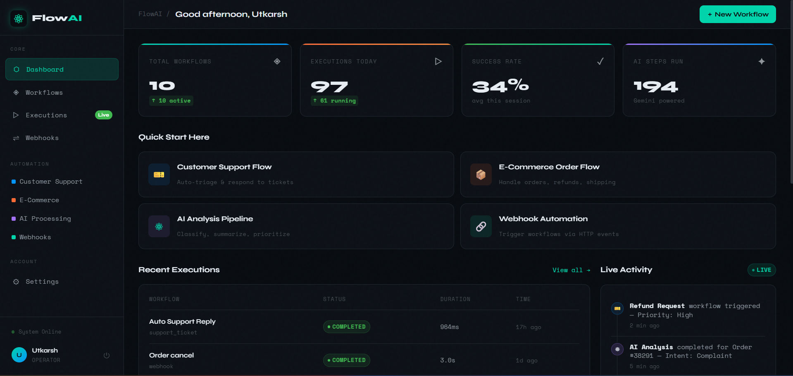
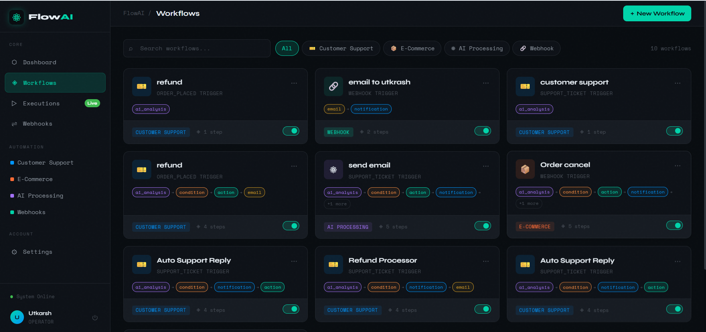
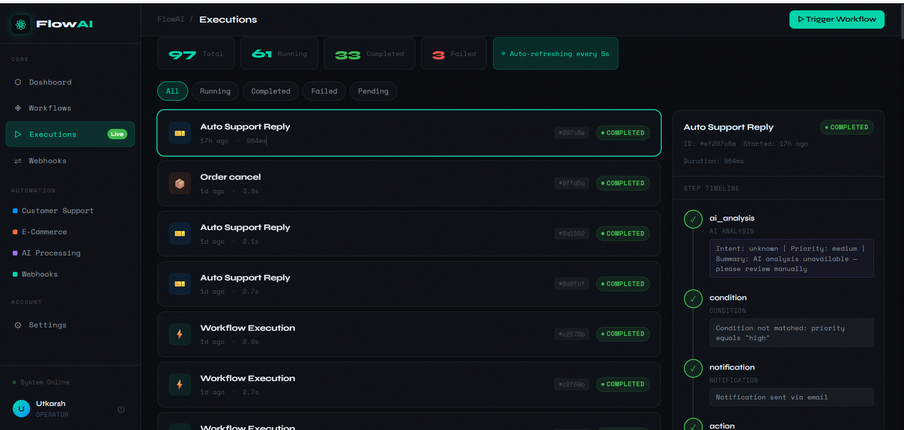
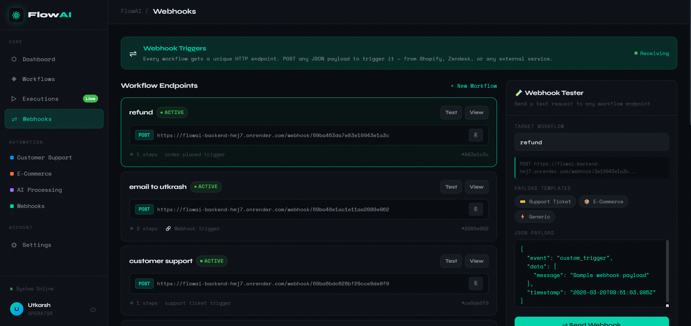
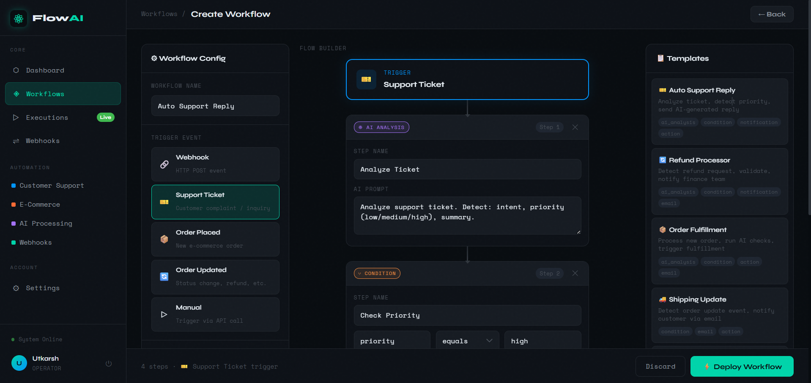
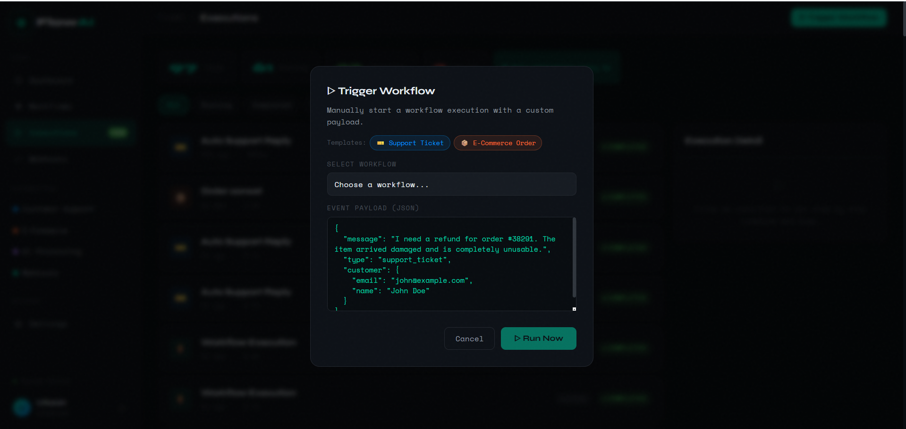

# FlowAI — AI Workflow Automation Platform

A full-stack automation platform that processes customer support tickets and e-commerce events through AI-powered multi-step workflows. Built on the MERN stack with Redis queue processing, Google Gemini AI integration, and real-time execution monitoring.

[](https://nodejs.org)
[](https://reactjs.org)
[](https://mongodb.com)
[](https://redis.io)

---

## Screenshots

### Dashboard
<!-- Replace the line below with your dashboard screenshot -->


```
📸 DASHBOARD SCREENSHOT.
```

---

### Workflow Builder


```
📸 WORKFLOW BUILDER SCREENSHOT
```

---

### Execution Monitor (Live Timeline)


```
📸 EXECUTIONS PAGE SCREENSHOT
```

---

### Webhook Tester
<!-- Replace the line below with your webhooks page screenshot -->
<!-- Example:  -->

```
📸 WEBHOOKS PAGE SCREENSHOT.
```

---

## What It Does

FlowAI lets you define automated workflows triggered by events (webhooks, support tickets, order updates). Each workflow runs a configurable chain of steps — AI analysis via Gemini, condition checks, notifications, and actions — processed asynchronously through a Redis queue with real-time progress monitoring in the browser.

---

## Tech Stack

| Layer | Technology |
|---|---|
| Frontend | React 18, Vite, plain CSS |
| Backend | Node.js, Express.js |
| Database | MongoDB + Mongoose |
| Queue | Redis + BullMQ |
| AI | Google Gemini API |
| Real-time | Socket.io |
| Auth | JWT (JSON Web Tokens) |

---

## Features

- **Visual Workflow Builder** — create multi-step workflows with a configurable canvas
- **AI Processing** — Gemini analyzes incoming messages to detect intent, priority, and generate summaries
- **Condition Engine** — route workflow execution based on AI output (e.g. `priority equals "high"`)
- **Webhook Triggers** — every workflow gets a unique HTTP endpoint for external integrations
- **Real-time Monitoring** — live execution timeline updates via Socket.io
- **Queue-based Execution** — BullMQ ensures reliable async processing with retry on failure
- **Execution Logs** — per-step log storage in MongoDB with full history
- **Pre-built Templates** — Auto Support Reply, Refund Processor, Order Fulfillment, Shipping Update

---

## Project Structure

```
ai-workflow-platform/
├── backend/
│   ├── src/
│   │   ├── config/          # db.js, redis.js
│   │   ├── controllers/     # authController, workflowController, executionController
│   │   ├── middleware/      # authMiddleware.js
│   │   ├── models/          # User, Workflow, Execution, Log
│   │   ├── queue/           # workflowQueue.js
│   │   ├── routes/          # authRoutes, workflowRoutes, executionRoutes, webhookRoutes
│   │   ├── services/        # workflowEngine.js, aiService.js
│   │   ├── socket/          # socketManager.js
│   │   └── workers/         # workflowWorker.js
│   ├── app.js
│   ├── server.js
│   └── worker.js
└── frontend/
    └── src/
        ├── components/      # AppShell, Sidebar, WorkflowCard, ExecutionTimeline
        ├── context/         # AuthContext.jsx
        ├── pages/           # Dashboard, Workflows, Executions, Webhooks, Settings
        ├── routes/          # AppRoutes.jsx
        ├── styles/          # per-page CSS files
        └── utils/           # api.js, useSocket.js
```

---

## Prerequisites

- Node.js v18+
- MongoDB (local or Atlas)
- Redis (local or cloud)
- Google Gemini API key — [get one here](https://aistudio.google.com/app/apikey)

---

## Installation

### 1. Clone the repository

```bash
git clone https://github.com/your-username/ai-workflow-platform.git
cd ai-workflow-platform
```

### 2. Backend setup

```bash
cd backend
npm install
```

Create a `.env` file in the `backend/` directory:

```env
PORT=5000
MONGO_URI=mongodb://localhost:27017/workflow_automation
REDIS_URL=redis://localhost:6379
JWT_SECRET=your_jwt_secret_key_here
GEMINI_API_KEY=your_gemini_api_key_here
```

### 3. Frontend setup

```bash
cd ../frontend
npm install
```

Create a `.env` file in the `frontend/` directory:

```env
VITE_API_URL=http://localhost:5000
```

---

## Running the Application

You need **three terminals** running simultaneously.

**Terminal 1 — Backend server:**
```bash
cd backend
node server.js
```

**Terminal 2 — Background worker:**
```bash
cd backend
node worker.js
```

**Terminal 3 — Frontend:**
```bash
cd frontend
npm run dev
```

Open [http://localhost:5173](http://localhost:5173) in your browser.

---

## Usage

### Create a workflow

1. Go to **Workflows → New Workflow**
2. Choose a trigger type (Webhook, Support Ticket, Order Placed, etc.)
3. Add steps: AI Analysis → Condition → Notification → Action
4. Click **Deploy Workflow**

<!-- INSERT SCREENSHOT: Create Workflow page with steps added -->
<!-- Example:  -->

```
📸 CREATE WORKFLOW SCREENSHOT
```

---

### Trigger via HTTP (Webhook)

Each workflow has a unique endpoint. Send a POST request with any JSON payload:

```bash
curl -X POST http://localhost:5000/webhook/YOUR_WORKFLOW_ID \
  -H "Content-Type: application/json" \
  -d '{
    "message": "I need a refund for order #38291. Item arrived damaged.",
    "type": "support_ticket",
    "customer": { "email": "customer@example.com", "name": "John Doe" }
  }'
```

### Trigger manually from UI

Go to **Executions → Trigger Workflow**, select a workflow, edit the payload, and click **Run Now**.

<!-- INSERT SCREENSHOT: Trigger modal with payload -->
<!-- Example:  -->

```
📸 TRIGGER MODAL SCREENSHOT.
```

---

### Example AI output

```
Intent:   refund_request
Priority: high
Summary:  Customer requesting refund for damaged order #38291
```

---

## API Endpoints

```
POST   /auth/register          Register a new user
POST   /auth/login             Login and receive JWT

GET    /workflows              List all workflows
POST   /workflows              Create a workflow
GET    /workflows/:id          Get workflow by ID
PUT    /workflows/:id          Update a workflow
DELETE /workflows/:id          Delete a workflow

POST   /executions/start       Trigger a workflow execution
GET    /executions             List all executions
GET    /executions/:id         Get execution by ID
GET    /executions/:id/logs    Get step-by-step logs

POST   /webhook/:workflowId    External webhook trigger (no auth required)
```

All protected endpoints require:
```
Authorization: Bearer <your_jwt_token>
```

---

## Workflow Step Types

| Step Type | What It Does |
|---|---|
| `ai_analysis` | Sends message to Gemini — returns intent, priority, summary |
| `condition` | Evaluates a field from AI output (e.g. `priority equals "high"`) |
| `action` | Executes an operation: `store_log`, `escalate`, `update_status`, etc. |
| `notification` | Sends an alert via email, Slack, SMS, or webhook |
| `email` | Sends a templated email to the customer |

---

## Environment Variables Reference

| Variable | Required | Description |
|---|---|---|
| `PORT` | Yes | Backend server port (default: 5000) |
| `MONGO_URI` | Yes | MongoDB connection string |
| `REDIS_URL` | Yes | Redis connection URL |
| `JWT_SECRET` | Yes | Secret key for signing JWT tokens |
| `GEMINI_API_KEY` | Yes | Google Gemini API key |

---

## Contributing

1. Fork the repository
2. Create a feature branch: `git checkout -b feature/your-feature-name`
3. Make your changes and commit: `git commit -m "feat: add your feature"`
4. Push to your fork: `git push origin feature/your-feature-name`
5. Open a Pull Request against the `main` branch

Please follow existing code style — plain CSS for frontend styles (no CSS frameworks), functional React components with hooks, and descriptive `console.log` statements in backend services.

---

## License

MIT License — see [LICENSE](LICENSE) for details.

---

## Author

Built by **Devesh_Sharma** as a backend-focused automation system project using MERN stack, BullMQ, and Google Gemini AI.
